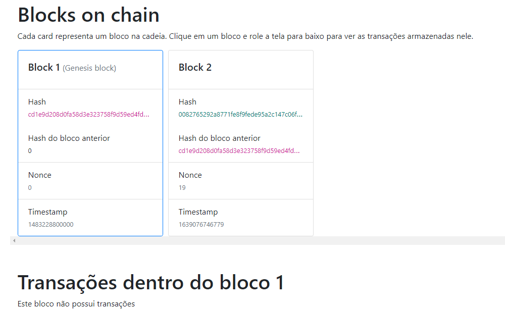
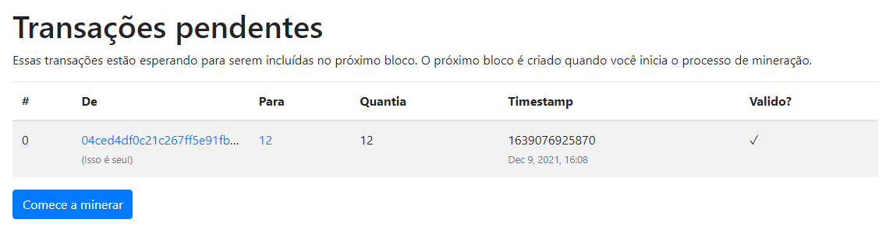

<div align="center">
  
</div>

<h2 align="center">Sumilando um blockchian Frontend</h2>

---

Aplicação angular que permite interagir com um blockchain. Você pode ver os blocos na cadeia, ver as transações dentro deles e até mesmo criar novas transações e blocos.

<h2>Ferramentas usadas</h2>
<li>Bootstrap 
<li>Angular framework

</br>


## 🏁 Como rodar em sua maquina <a name = "getting_started"></a>
Obtenha uma cópia do front-end em sua máquina local (para brincar, testar ou desenvolver).

```
git clone https://github.com/goblockchain/simulating_blockchain_frontend.git
```

Baixar dependências:
```
npm install
```

Rodar a aplicação:
```
npm start
```

Neste ponto, o aplicativo deve estar sendo executado em sua máquina em [http://localhost:4200](http://localhost:4200)


## 📸 Screenshots

 
<h3>Home page:</h3> 
<p>Vendo os blocos na cadeia e explorando as transações em cada bloco.</p>


---
</br>

<h3>Criando novas transações:</h3> <p>Você pode criar novas transações para qualquer carteira de qualquer valor (sem validação). Novas transações serão adicionadas às "transações pendentes", prontas para serem incluídas no próximo bloco.</p>


---
</br>

<h3>Transações pendentes:</h3> 
<p> Lista de todas as transações pendentes. Eles serão incluídos no próximo bloco quando o processo de mineração começar.</p>


---
</br>

<h3>Essa aplicação foi desenvolvida em cima de um video no youtube, o link do video está a baixo</h3>
<a>https://www.youtube.com/watch?v=AQV0WNpE_3g</a>

⚠️Isso é apenas para fins educacionais. Isso não é de forma alguma uma implementação de blockchain completa (nem pretende ser uma). Use-o para aprender como os blockchains funcionam.